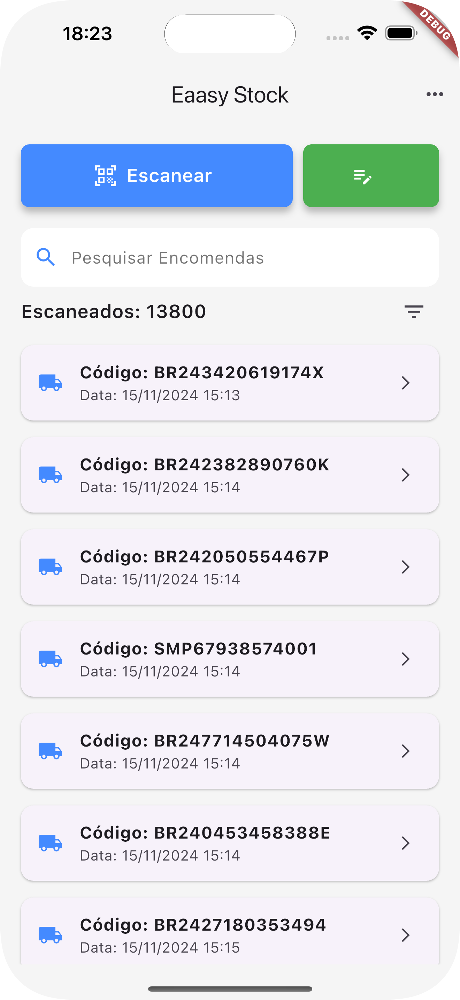
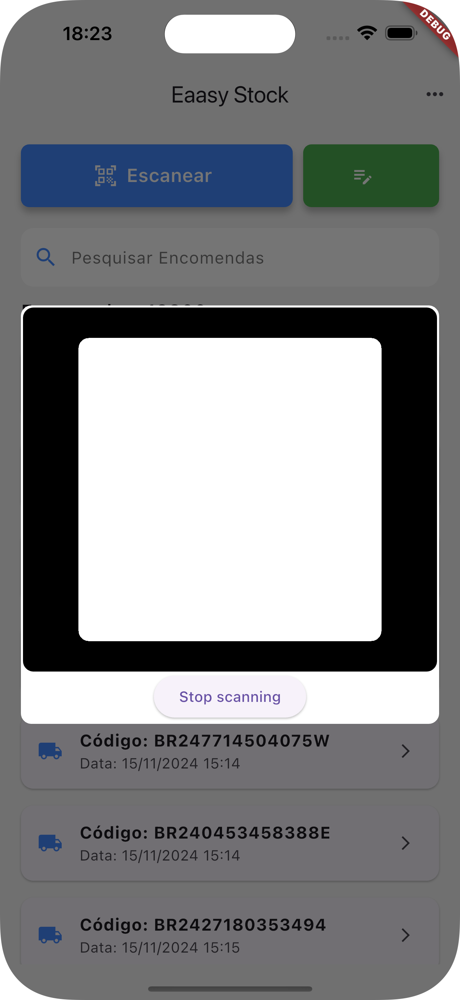
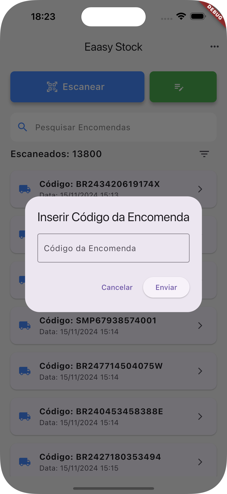

<!-- Banner -->
## 📸 Capturas de Tela

Aqui estão algumas capturas de tela do aplicativo **Eaasy Stok**:

| Home | Registro QR Code | Registro Automático |
|------|----------------|---------------------|
|  |  |  |


# Eaasy Stock

O **Eaasy Stock** é um aplicativo desenvolvido em Flutter que realiza o escaneamento de códigos QR ou de barras para verificar e registrar a entrada de pacotes no estoque. O aplicativo compara os códigos escaneados com os dados armazenados no Firebase. Caso um código não seja encontrado, ele é salvo no Firebase para que haja um controle de estoque. Além disso, o app organiza os registros por data, exibindo quantos pacotes foram registrados em cada dia, e valida se o código possui um formato correto (evitando, por exemplo, formatos inválidos como CEP).

---

## Sumário

- [Visão Geral](#visão-geral)
- [Arquitetura e Estrutura de Pastas](#arquitetura-e-estrutura-de-pastas)
- [Dependências](#dependências)
- [Como Executar](#como-executar)
- [Funcionalidades](#funcionalidades)
- [Como Contribuir](#como-contribuir)
- [Licença](#licença)

---

## Visão Geral

O **Eaasy Stock** é projetado para facilitar o controle de estoque por meio do registro automático de pacotes. Após escanear o código do pacote, o sistema:
- Verifica a existência do código no Firebase.
- Registra o código no Firebase se ele não for encontrado.
- Agrupa os registros por data para facilitar a apuração diária.
- Valida o formato do código, descartando registros com formatos inválidos (por exemplo, um CEP).

---

## Arquitetura e Estrutura de Pastas

A estrutura do projeto segue o padrão abaixo:

```plaintext
lib/
├─ app/
│  ├─ data/
│  │  └─ localized_stirngs.dart   # Arquivo de strings localizadas
│  ├─ modules/
│  │  └─ home/
│  │     ├─ bindings/
│  │     │  └─ home_binding.dart   # Injeção de dependências para o módulo Home
│  │     ├─ controllers/
│  │     │  └─ home_controller.dart   # Lógica de controle do módulo Home
│  │     ├─ models/
│  │     │  └─ delivery_model.dart   # Modelo de dados para as entregas/registro dos pacotes
│  │     ├─ services/
│  │     │  ├─ excel_services.dart    # Serviço para exportação de dados para Excel
│  │     │  ├─ firebase_services.dart   # Serviço de comunicação com o Firebase
│  │     │  └─ storage_services.dart    # Serviço para gerenciamento de armazenamento local
│  │     ├─ views/
│  │     │  └─ home_view.dart   # Interface principal do módulo Home
│  │     └─ widgets/
│  │        ├─ custom_toast.dart      # Widget para exibição de Toasts customizados
│  │        ├─ filter_dialog.dart     # Diálogo para filtros de busca
│  │        └─ manual_code_dialog.dart   # Diálogo para inserção manual de código
│  └─ routes/
│     ├─ app_pages.dart   # Definição das páginas e rotas da aplicação
│     └─ app_routes.dart  # Configuração das rotas
└─ main.dart   # Ponto de entrada da aplicação
```

## Dependências
Extraídas do arquivo `pubspec.yaml`, as principais dependências e suas versões são:

- **flutter**  
  SDK base para o desenvolvimento em Flutter.

- **cupertino_icons: ^1.0.8**  
  Ícones estilo iOS para a interface.

- **get: ^4.6.6**  
  Gerenciamento de estado, injeção de dependências e navegação.

- **audioplayers: ^6.1.0**  
  Reprodução de áudio, possivelmente para feedback sonoro durante operações.

- **intl: ^0.19.0**  
  Suporte à internacionalização e formatação de datas e números.

- **qr_bar_code_scanner_dialog: ^0.0.5**  
  Funcionalidade para escanear QR codes e códigos de barras através de um diálogo customizado.

- **fluttertoast: ^8.2.8**  
  Exibição de mensagens tipo Toast para feedback visual ao usuário.

- **shared_preferences: ^2.3.3**  
  Armazenamento simples de dados persistentes localmente.

- **excel: ^4.0.6**  
  Exportação de dados para planilhas Excel.

- **share_plus: ^10.1.2**  
  Compartilhamento de conteúdo entre aplicativos.

- **icons_launcher: ^3.0.0**  
  Geração de ícones de lançamento para a aplicação.

- **rename_app: ^1.6.1**  
  Ferramenta para renomear o aplicativo facilmente.

### Dev Dependencies:
- **flutter_test**  
  Framework para testes em Flutter.

- **flutter_lints: ^4.0.0**  
  Conjunto de regras de lint para garantir a qualidade do código.

---

## Como Executar
Clone o repositório:
```bash
git clone https://github.com/seu-usuario/eaasy_stock.git
cd eaasy_stock
```

Instale as dependências:
```bash
flutter pub get
```

Execute a aplicação:
```bash
flutter run
```

**Observação:** Certifique-se de que seu ambiente Flutter está devidamente configurado para o dispositivo de destino (emulador, dispositivo físico ou web).

---

## Funcionalidades
### Escaneamento de Códigos:
Permite o escaneamento de QR codes ou códigos de barras para identificar pacotes.

### Comparação com Firebase:
Compara o código escaneado com os dados no Firebase; se o código não existir, ele é registrado para apuração de estoque.

### Registro por Data:
Organiza os registros de pacotes por data, exibindo a quantidade de pacotes registrados em cada dia.

### Validação de Formato:
Verifica se o código possui um formato válido, evitando registros com dados incorretos (por exemplo, formatos de CEP).

---

## Licença
Este projeto está licenciado sob a **MIT License**.

**Observação:** Este README será atualizado conforme novas funcionalidades forem implementadas.
