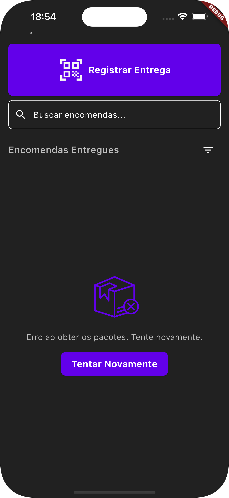
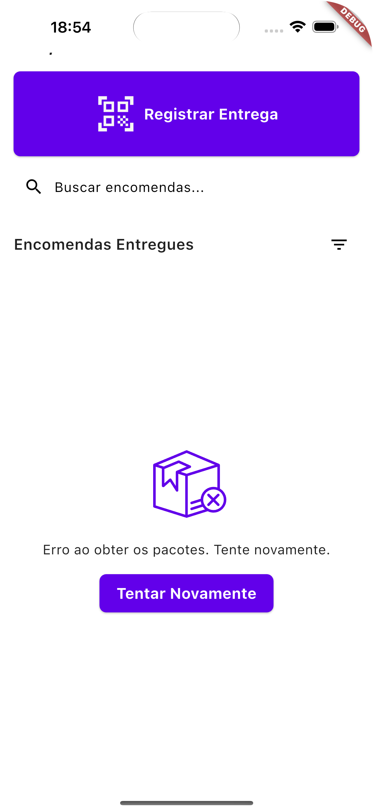

<!-- Banner -->
## 📸 Capturas de Tela

Aqui estão algumas capturas de tela do aplicativo **Entrega Hub**:

| Take 1 | Take 2 |
|--------|--------|
|  |  |

| Take 3 | Take 4 |
|--------|--------|
|  |  |


# Entregas Hub

O **Entregas Hub** é o aplicativo destinado aos entregadores, onde é possível registrar uma entrega. No processo de registro, o entregador insere os dados do recebedor e o grau de parentesco, anexa uma foto da encomenda e escaneia para obter o código de rastreio atrelado ao pacote. O aplicativo se integra com a [API do Entregas Hub](https://github.com/MikaelDDavidd/entregas_hub/tree/main/entregas_hub_back_end) para armazenar e gerenciar os dados das entregas.

---

## Sumário

- [Visão Geral](#visão-geral)
- [Arquitetura e Estrutura de Pastas](#arquitetura-e-estrutura-de-pastas)
- [Dependências](#dependências)
- [Como Executar](#como-executar)
- [Funcionalidades](#funcionalidades)
- [Como Contribuir](#como-contribuir)
- [Licença](#licença)

---

## Visão Geral

O **Entregas Hub** permite que o entregador registre as entregas realizando as seguintes ações:
- Inserir dados do recebedor e grau de parentesco.
- Anexar uma foto da encomenda.
- Escanear o código de rastreio para identificar o pacote.

Todos esses dados são enviados para a API, que gerencia o armazenamento e o processamento das informações.

---

## Arquitetura e Estrutura de Pastas

A estrutura do projeto segue o padrão abaixo:

```plaintext
lib/
├─ app/
│  ├─ data/
│  │  ├─ api_service.dart   # Comunicação com a API
│  │  ├─ app_values.dart     # Valores e constantes da aplicação
│  │  └─ storage.dart        # Gerenciamento de armazenamento local
│  ├─ models/
│  │  └─ package_model.dart  # Modelo de dados para pacotes/entregas
│  ├─ modules/
│  │  ├─ home/
│  │  │  ├─ bindings/
│  │  │  │  └─ home_binding.dart  # Injeção de dependências do módulo Home
│  │  │  ├─ controllers/
│  │  │  │  ├─ home_controller.dart   # Lógica principal da tela Home
│  │  │  │  └─ upload_controller.dart # Gerenciamento do upload de fotos e dados
│  │  │  ├─ views/
│  │  │  │  └─ home_view.dart    # Interface principal do módulo Home
│  │  │  └─ widgets/
│  │  │     ├─ confirmar_entrega_dialog.dart  # Diálogo de confirmação de entrega
│  │  │     ├─ confirmation_screen.dart         # Tela de confirmação
│  │  │     ├─ delivery_screen.dart               # Tela para registro da entrega
│  │  │     ├─ dialogs.dart                       # Outros diálogos de interação
│  │  │     ├─ error_screen.dart                  # Tela de erro
│  │  │     ├─ item_dialog.dart                   # Diálogo para itens adicionais
│  │  │     └─ qr_view_example.dart               # Exemplo de leitura de QR/barcode
│  │  └─ login/
│  │     ├─ bindings/
│  │     │  └─ login_binding.dart   # Injeção de dependências do módulo Login
│  │     ├─ controllers/
│  │     │  └─ login_controller.dart  # Lógica de autenticação e login
│  │     └─ views/
│  │        ├─ class Zoologico:.py.py  # (Possivelmente um arquivo exemplo ou de teste)
│  │        └─ login_view.dart         # Interface de login
│  └─ routes/
│     ├─ app_pages.dart   # Definição das páginas e rotas
│     └─ app_routes.dart  # Configurações de rotas
├─ theme/
│  ├─ app_theme.dart      # Configuração do tema principal da aplicação
│  ├─ button_styles.dart  # Estilos para botões
│  ├─ colors.dart         # Paleta de cores
│  └─ text_styles.dart    # Estilos de textos
├─ amplifyconfiguration.dart  # Configuração do Amplify (se utilizado)
├─ main.dart              # Ponto de entrada da aplicação
└─ Untitled-1             # Arquivo sem nome ou arquivo auxiliar
```

## Dependências
Extraídas do `pubspec.yaml`, as principais dependências e suas utilizações são:

- **flutter**  
  SDK base para desenvolvimento em Flutter.

- **cupertino_icons: ^1.0.6**  
  Ícones padrão do iOS.

- **http: ^1.3.0**  
  Realiza requisições HTTP para comunicação com a API.

- **image: ^4.2.0**  
  Manipulação e processamento de imagens.

- **get: ^4.6.6**  
  Gerenciamento de estado, injeção de dependências e navegação.

- **flutter_svg: ^2.0.11**  
  Renderização de imagens SVG.

- **get_storage: ^2.1.1**  
  Armazenamento local simples e rápido.

- **image_picker: ^1.1.2**  
  Selecionar imagens da galeria ou capturar via câmera.

- **uuid: ^4.5.1**  
  Geração de identificadores únicos, útil para rastreamento de entregas.

- **fluttertoast: ^8.2.8**  
  Exibição de mensagens Toast para feedback rápido ao usuário.

- **photo_manager: ^3.6.2**  
  Gerenciamento de fotos e acesso à galeria do dispositivo.

- **shared_preferences: ^2.3.3**  
  Armazenamento de pequenas preferências e dados persistentes.

- **dio: ^5.7.0**  
  Cliente HTTP avançado, com suporte a interceptors e outras funcionalidades.

- **hive: ^2.2.3**  
  Banco de dados local rápido e leve.

- **hive_flutter: ^1.1.0**  
  Integração do Hive com Flutter para armazenamento local.

- **intl: ^0.19.0**  
  Internacionalização e formatação de datas, números, etc.

- **saver_gallery: ^4.0.0**  
  Salvar imagens diretamente na galeria do dispositivo.

- **permission_handler: ^10.2.0**  
  Gerenciamento e solicitação de permissões do dispositivo.

- **qr_bar_code_scanner_dialog**  
  Implementação personalizada para escanear QR e códigos de barras.  
  _Fonte: qr_bar_code_scanner_dialog_

### Dev Dependencies:
- **hive_generator: ^2.0.1**  
  Geração automática de código para o Hive.

- **build_runner: ^2.4.13**  
  Ferramenta de build para geração de código.

- **flutter_test**  
  Framework de testes para Flutter.

- **flutter_lints: ^3.0.0**  
  Regras de lint para garantir a qualidade do código.

---

## Como Executar
Clone o repositório:
```bash
git clone https://github.com/seu-usuario/entrega_hub.git
cd entrega_hub
```

Instale as dependências:
```bash
flutter pub get
```

Execute a aplicação:
```bash
flutter run
```

**Observação:** Certifique-se de que seu ambiente Flutter está devidamente configurado para o dispositivo de destino (emulador, dispositivo físico ou web).

---

## Funcionalidades
### Registro de Entregas:
Permite que o entregador insira os dados do recebedor, grau de parentesco e anexe uma foto da encomenda.

### Escaneamento de Código:
Utiliza a funcionalidade de QR/barcode para capturar o código de rastreio atrelado ao pacote.

### Integração com API:
Os dados coletados são enviados para a API do Entregas Hub para armazenamento e gerenciamento.  
**Acesse a API em:** [Entregas Hub API](https://github.com/MikaelDDavidd/entregas_hub/tree/main/entregas_hub_back_end)

---

## Como Contribuir
1. Faça um fork do repositório.
2. Crie uma branch para a sua feature:
```bash
git checkout -b feature/nova-funcionalidade
```
3. Realize as alterações e efetue commits com mensagens claras.
4. Envie a branch para o repositório remoto:
```bash
git push origin feature/nova-funcionalidade
```
5. Abra um Pull Request descrevendo as alterações realizadas.

---

## Licença
Este projeto está licenciado sob a **MIT License**.

**Observação:** Este README será atualizado conforme novas funcionalidades forem implementadas.
