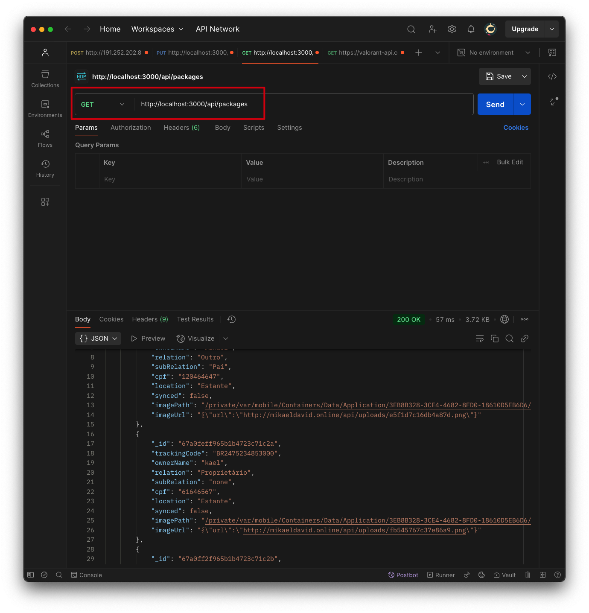

<!-- Banner -->
## 📸 Captura de Tela - Postman

Aqui está a captura de tela mostrando a resposta da API no **Postman**:



---

# Documentação da API Entregas Hub

A **API Entregas Hub** é um serviço RESTful construído com Node.js, Express e MongoDB. Ela gerencia operações de entrega, como listagem, criação e atualização de registros de entregas, além de realizar o upload de imagens associadas às entregas.

---

## Sumário

- [Visão Geral](#visão-geral)
- [Estrutura do Projeto](#estrutura-do-projeto)
- [Dependências](#dependências)
- [Rotas e Endpoints](#rotas-e-endpoints)
- [Configuração e Ambiente](#configuração-e-ambiente)
- [Como Executar](#como-executar)
- [Licença](#licença)

---

## Visão Geral

A API Entregas Hub foi desenvolvida para gerenciar registros de entregas. Suas principais funcionalidades são:

- **Listar entregas:** Recupera a lista de registros de entregas.
- **Criar uma nova entrega:** Registra os dados de uma nova entrega.
- **Atualizar uma entrega:** Atualiza os dados de uma entrega já existente.
- **Upload de imagens:** Permite o envio e processamento de imagens associadas às entregas.

Os dados das entregas são armazenados em um banco de dados MongoDB, enquanto os arquivos de imagem são tratados pelo Multer e salvos na pasta `uploads`. O CORS está habilitado para permitir requisições do frontend (por exemplo, `http://localhost:3000`).

---

## Estrutura do Projeto

```plaintext
entregas_hub_back_end/
├─ src/
│  ├─ config/
│  │  └─ db_config.js           # Configuração de conexão com o MongoDB
│  ├─ controller/
│  │  └─ deliveries_controller.js  # Funções de controle para os endpoints de entregas
│  ├─ models/
│  │  └─ deliveries_model.js    # Modelo Mongoose para entregas
│  ├─ routes/
│  │  └─ deliveries_routes.js   # Definição das rotas da API
│  └─ services/
│     └─ gemini_service.js      # Serviços adicionais (ex.: integração com sistemas externos)
├─ uploads/                     # Pasta para armazenar imagens enviadas
│  └─ (arquivos de imagem)
├─ .env                        # Variáveis de ambiente
├─ package-lock.json
├─ package.json
└─ server.js                   # Ponto de entrada do servidor
```

---

## Dependências
Principais dependências listadas no `package.json`:

- **express (^4.21.1)**  
  Framework para construção da API.

- **cors (^2.8.5)**  
  Middleware que habilita o CORS para permitir requisições de outros domínios.

- **dotenv (^16.4.5)**  
  Carrega variáveis de ambiente a partir do arquivo `.env`.

- **mongodb (^6.11.0)**  
  Driver para conectar e interagir com o banco de dados MongoDB.

- **multer (^1.4.5-lts.1)**  
  Middleware para tratamento de uploads de arquivos (imagens).

- **body-parser (^1.20.3)**  
  Parseia requisições com payloads JSON.

- **firebase (^11.0.2)** e **firebase-admin (^13.0.1)**  
  Integração com serviços Firebase (se necessário).

- **@google/generative-ai (^0.21.0)**  
  Integração com serviços de IA generativa (conforme o contexto do projeto).

---

## Rotas e Endpoints
A API define as seguintes rotas:

- **GET /api/packages**  
  Recupera a lista de registros de entregas.  
  _Handler:_ `listDeliveries` (em `deliveries_controller.js`)

- **POST /api/packages**  
  Cria um novo registro de entrega.  
  _Handler:_ `postNewDelivery` (em `deliveries_controller.js`)

- **POST /api/upload**  
  Faz o upload de uma imagem associada a uma entrega.  
  _Utiliza:_ Multer para tratamento do arquivo.  
  _Handler:_ `uploadProductImage` (em `deliveries_controller.js`)

- **PUT /api/upload/:id**  
  Atualiza uma entrega com uma nova imagem.  
  _Handler:_ `updateNewDelivery` (em `deliveries_controller.js`)

---

## Configuração do Upload de Arquivos
A configuração do Multer para tratamento do upload de imagens:

```javascript
const storage = multer.diskStorage({
  destination: (req, file, cb) => {
    cb(null, uploadsPath); // Os arquivos são salvos na pasta "uploads"
  },
  filename: (req, file, cb) => {
    const randomName = crypto.randomBytes(8).toString("hex");
    const fileExtension = path.extname(file.originalname);
    cb(null, `${randomName}${fileExtension}`); // Ex.: 9f8d7c6a2b1d4e5f.png
  },
});
```

Além disso, a pasta `uploads` é exposta estaticamente:

```javascript
app.use("/uploads", express.static(path.join(process.cwd(), "uploads")));
```

---

## Configuração e Ambiente
### Variáveis de Ambiente:
São configuradas por meio do arquivo `.env`. Você deve definir variáveis como:
- URI do MongoDB
- PORT
- Outras configurações específicas do projeto

### Configuração do Banco de Dados:
A conexão com o MongoDB é gerenciada em `src/config/db_config.js`.

---

## Como Executar
Clone o repositório:
```bash
git clone https://github.com/seu-usuario/entregas_hub_back_end.git
cd entregas_hub_back_end
```

Instale as dependências:
```bash
npm install
```

Configure as Variáveis de Ambiente:  
Crie um arquivo `.env` na raiz do projeto e defina as variáveis necessárias (por exemplo, a URI do MongoDB e a PORT).

Execute o Servidor:
```bash
npm run dev
```

O servidor iniciará em modo de monitoramento (watch mode) e ficará disponível na porta configurada.

---

## Licença
Este projeto está licenciado sob a **AGPL-version-3.0**. Consulte o arquivo LICENSE para mais detalhes.

**Observação:** Esta documentação pode ser atualizada conforme a API evoluir.
