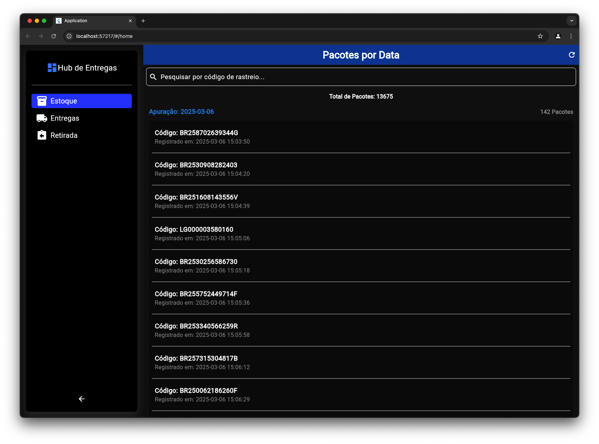

<!-- Banner -->
## 📸 Captura de Tela - Painel de Estoque

Aqui está a captura de tela da tela de estoque no painel de administração:



---

# Entregas Hub Web Panel

O **Entregas Hub Web Panel** é um painel web desenvolvido em Flutter para monitorar, em tempo real, as operações de entrega, retirada e controle de estoque do Kit de Logística de Encomendas.

---

## Sumário

- [Visão Geral](#visão-geral)
- [Arquitetura do Projeto](#arquitetura-do-projeto)
- [Estrutura de Pastas](#estrutura-de-pastas)
- [Dependências](#dependências)
- [Como Executar](#como-executar)
- [Funcionalidades](#funcionalidades)
- [Como Contribuir](#como-contribuir)
- [Licença](#licença)

---

## Visão Geral

O **Entregas Hub Web Panel** integra-se ao ecossistema do Kit de Logística de Encomendas, permitindo o acompanhamento e gerenciamento das entregas, retiradas e estoque dos pacotes de forma centralizada. A aplicação utiliza o GetX para gerenciamento de estado, injeção de dependências e navegação, além de integrar serviços do Firebase para atualização em tempo real no módulo de estoque.

---

## Arquitetura do Projeto

A aplicação segue uma arquitetura modular, separando as funcionalidades em diferentes módulos:

- **Módulo Home:** Apresenta informações gerais e o dashboard principal.
- **Módulo Stock:** Gerencia o controle do estoque dos pacotes, exibindo dados em tempo real via Firebase.

Outros aspectos importantes da arquitetura:
- **Comunicação com a API:** Implementada na pasta `data/api`.
- **Modelos de Dados:** Definidos na pasta `models`, por exemplo, o `delivery_model.dart`.
- **Configuração de Rotas:** Gerenciada através dos arquivos em `routes` (`app_pages.dart` e `app_routes.dart`).
- **Serviços:** Como o `firebase_service.dart` para integrar a aplicação ao Firebase.
- **Temas e Widgets:** Personalizações de UI estão concentradas em `theme` e `widgets`.

---

## Estrutura de Pastas

```plaintext
lib/
├─ app/
│  ├─ data/
│  │  └─ api/                # Comunicação com a API
│  ├─ models/
│  │  └─ delivery_model.dart # Modelo de dados para entregas
│  ├─ modules/
│  │  ├─ home/               # Módulo Home
│  │  │  ├─ bindings/
│  │  │  │  └─ home_binding.dart
│  │  │  ├─ controllers/
│  │  │  │  └─ home_controller.dart
│  │  │  └─ views/
│  │  │     └─ home_view.dart
│  │  └─ stock/              # Módulo de Estoque
│  │     ├─ bindings/
│  │     │  └─ stock_binding.dart
│  │     ├─ controllers/
│  │     │  └─ stock_controller.dart
│  │     └─ views/
│  │        └─ stock_view.dart
│  ├─ routes/                # Configuração de rotas
│  │  ├─ app_pages.dart
│  │  └─ app_routes.dart
│  ├─ services/              # Serviços, como o Firebase
│  │  └─ firebase_service.dart
│  ├─ theme/                 # Temas e estilos da aplicação
│  │  ├─ app_theme.dart
│  │  ├─ buttons.dart
│  │  ├─ colors.dart
│  │  ├─ text_styles.dart
│  │  └─ theme.dart
│  └─ widgets/               # Widgets e componentes customizados
│     └─ custom_toast.dart
└─ main.dart                 # Ponto de entrada da aplicação
```

## Dependências

Principais dependências utilizadas (conforme o pubspec.yaml):

- **Flutter SDK:** Framework base para o desenvolvimento da aplicação.
- **GetX:** Gerenciamento de estado, injeção de dependências e navegação.
`import 'package:get/get.dart';`
- **Firebase:** Utilizado para atualizações em tempo real no módulo de estoque, por meio do firebase_service.dart.
- **Nota: Para detalhes sobre as versões específicas das dependências, consulte o arquivo pubspec.yaml.**

---

## Como Executar
- **Clone o repositório:**

# Entregas Hub Web Panel

## Instalação
```bash
git clone https://github.com/seu-usuario/entregas_hub_web_panel.git
cd entregas_hub_web_panel
```

### Instale as dependências:
```bash
flutter pub get
```

### Execute a aplicação:
```bash
flutter run -d chrome
```

**Observação:** Certifique-se de que o suporte para web está habilitado no Flutter para rodar a aplicação no navegador.

---

## Funcionalidades
- **Interface Responsiva:** Design adaptável para diferentes tamanhos de tela.
- **Navegação Simplificada:** Gerenciada pelo GetX, proporcionando transições suaves entre os módulos.
- **Atualização em Tempo Real:** Dados do estoque atualizados via Firebase.
- **Temas Personalizados:** Suporte aos temas claro e escuro, configurados em AppTheme.

---

## Licença
Este projeto está licenciado sob a **MIT License**.

**Observação:** Este README será atualizado conforme novas funcionalidades forem implementadas.

